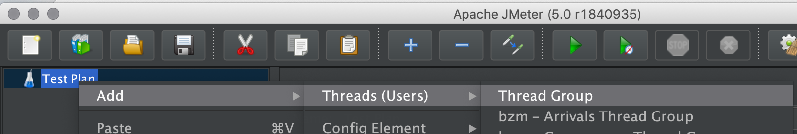
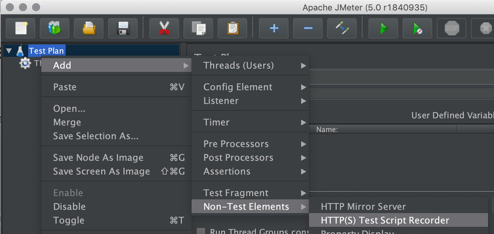
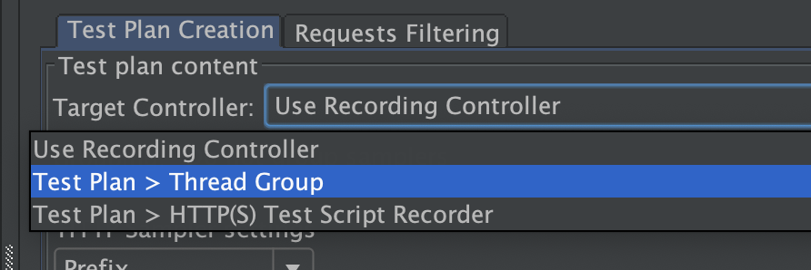
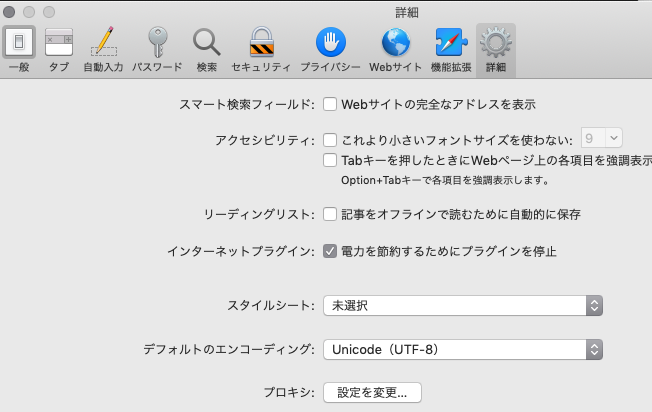
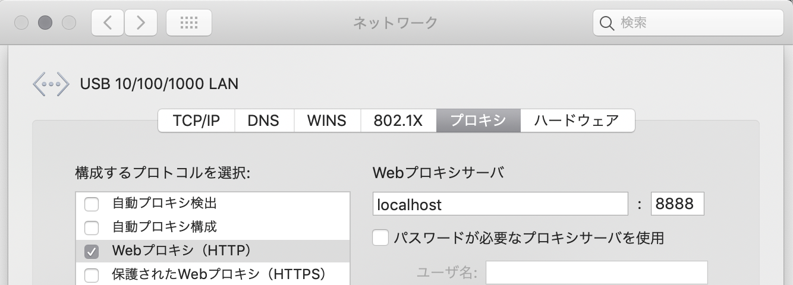

## 前提
- 環境:Mac
- AWSとかで負荷試験を行う前にJmeterのシナリオをローカル環境で作りたくなる。
- そして、毎回、Jmeterをローカル環境で使うときに設定方法を忘れ、時間を無駄にしてしまう。

## 初回のみ作業
### jmeter のインストール
```  
brew install jmeter  
```

### 起動
```  
jmeter
```

## テスト計画毎に設定
### スレッドグループ作成
テスト計画のスレッドグループを作成


### プロキシ作成
プロキシサーバを作成(英語では、HTTP(S) Test Script Recorderで一瞬わからなかった。。)



### TargetControllerの設定
TargetControllerに、作成したスレッドグループを指定する。  



### Safariでプロキシサーバの設定
- Safari->環境設定->詳細タブ->プロキシ：設定変更を押下


- ネットワークダイアログのプロキシタブの「Webプロキシ(HTTP)」にチェックをいれる。
- localhostとポート8888を設定する(ポートはJmeterのプロキシと合わせる)


### ローカルPCのIPアドレスを確認
```  
ifconfig  
```
### 調べたIPアドレスをhostsに追加
```
192.xxx.xxx.xxx hoge.com
```

### Jmeter 起動
Startのボタンを押下。


### アプリサーバーを起動
アプリサーバーは、ポート8080などで起動

### Safariから下記の様にアクセスするとThreadGropに記録される
>http://hoge.com:8080


## 最後に
テスト完了などをしたら、Safariで設定したプロキシサーバの設定を戻すのを忘れずに！
